# 🎟️ ICT Directorate Job Ticketing System

[](https://www.djangoproject.com/)
[](https://www.python.org/)
[](https://render.com/)
[](https://redis.io/)
[](LICENSE)

A web-based **ICT Support Ticketing System** designed for the **Redeemer’s University ICT Directorate**.  
It enables students and staff to submit, manage, and track ICT-related requests — while administrators oversee and assign tickets efficiently.

---

## 🚀 Features

- User registration and authentication  
- Role-based access control (**Admin**, **Staff**, **Student**)  
- Automatic role detection based on ID and department from a Google Drive CSV  
- Ticket creation, assignment, and progress tracking  
- Real-time WebSocket notifications  
- Comment and feedback system  
- Admin dashboard for user and ticket management  
- Responsive UI built with **Bootstrap**  

---

## ⚙️ Tech Stack

| Component | Technology |
|------------|-------------|
| Framework | Django 4.2, Django Channels |
| Database | SQLite (local) / Render Postgres (optional) |
| Frontend | HTML, CSS, Bootstrap |
| WebSockets | Redis + Channels |
| Deployment | Render |
| External Data | Google Drive CSV integration |

---

## 🧩 How It Works

### 1️⃣ Registration & Role Assignment


**Notes**

* The system fetches the user data dynamically from Google Drive (CSV).
* The form auto-fills first name, last name, and department.
* If the department is **DICT**, the role is set to **staff**; otherwise, **student**.
* Admins are created manually as superusers.

---

### 2️⃣ Ticket Lifecycle

```mermaid
flowchart LR
    A[User creates ticket] --> B[Ticket saved - pending]
    B --> C{Admin assigns staff?}
    C -- Yes --> D[Status = assigned]
    D --> E[Staff starts work → In Progress]
    E --> F[Staff resolves → Resolved]
    F --> G[Admin/Staff closes → Closed]
    C -- No --> B
```



**Notes**

* Students: view and track only their tickets.
* Staff: see tickets assigned to them.
* Admins: view and manage all tickets.

---

### 3️⃣ Real-time Notifications


**Triggered when:**

* Ticket is created
* Status is updated
* Ticket is assigned

**Tech used:**

* ASGI via `daphne`
* `channels_redis` for WebSockets
* `ws/notifications/` route for live updates

---

## 🛠️ Installation (Local Setup)

```bash
# 1. Clone repository
git clone https://github.com/YourUsername/ticketing-system-backend.git
cd ticketing-system-backend

# 2. Create a new Conda environment
conda create -n ticketingenv python=3.11

# 3. Activate the environment
conda activate ticketingenv

# 4. Install dependencies
pip install -r requirements.txt

# 5. Apply migrations
python manage.py migrate

# 6. Create superuser
python manage.py createsuperuser

# 7. Run server
python manage.py runserver
```

---

## 🌐 Deployment on Render

* Uses **Daphne** as ASGI server
* **Redis** via external service (e.g. Redis Cloud or Upstash)
* **WhiteNoise** for static file serving

### Environment Variables

| Key                 | Description                |
| ------------------- | -------------------------- |
| `DJANGO_SECRET_KEY` | Your Django secret key     |
| `REDIS_URL`         | Your Redis connection URL  |
| `PYTHON_VERSION`    | Python version (e.g. 3.13.2) |

---

## 👥 Contributors

| Name                      | Role                             |
| ------------------------- | -------------------------------- |
| **Tomide Stephen Ayoola** | Backend Developer / Project Lead |
| **Joanne Atinuke Mcewen** | Frontend Developer / Project Lead|
| **DICT Directorate**      | Institutional Partners           |

---

## 🧾 License

**MIT License © 2025 Tomide Stephen Ayoola & Joanne Atinuke Mcewen**

Permission is hereby granted, free of charge, to any person obtaining a copy of this software and associated documentation files (the "Software"), to deal in the Software without restriction, including without limitation the rights to use, copy, modify, merge, publish, distribute, sublicense, and/or sell copies of the Software, and to permit persons to whom the Software is furnished to do so, subject to the following conditions:

The above copyright notice and this permission notice shall be included in all copies or substantial portions of the Software.

THE SOFTWARE IS PROVIDED "AS IS", WITHOUT WARRANTY OF ANY KIND, EXPRESS OR IMPLIED, INCLUDING BUT NOT LIMITED TO THE WARRANTIES OF MERCHANTABILITY, FITNESS FOR A PARTICULAR PURPOSE AND NONINFRINGEMENT.


